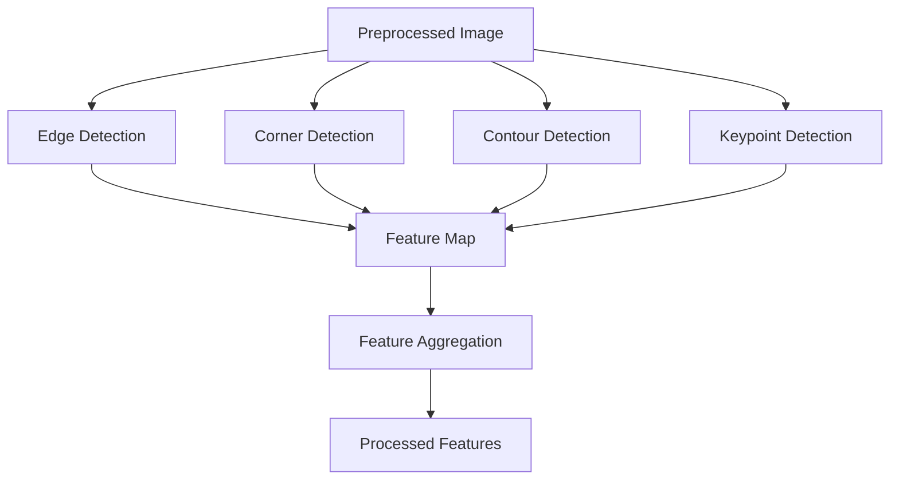
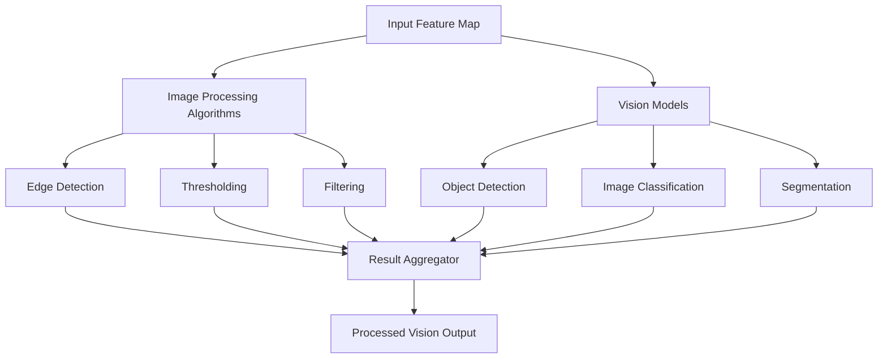

# Computer Vision Playground Dashboard


An **interactive computer vision experimentation dashboard** designed to help developers, researchers, and students explore multiple computer vision algorithms in a unified interface.

The **Computer Vision Playground Dashboard** allows users to upload images, apply different computer vision techniques, and visualize results in real time. The platform simplifies experimentation with vision algorithms by integrating preprocessing, model execution, and visualization into a single interactive environment.

---

# Table of Contents

- Introduction  
- System Architecture  
- Detailed System Architecture  
- Preprocessing Pipeline Architecture  
- Feature Extraction Pipeline  
- Computer Vision Processing Engine  
- Visualization Architecture  
- End-to-End Data Flow  
- System Modules  
- Technology Stack  
- Installation  
- Usage  
- Real World Applications  
- Advantages of the Project  
- Future Improvements  
- Conclusion  

---

# Introduction

Computer vision development usually requires testing multiple algorithms, preprocessing pipelines, and visualization techniques separately. This often leads to fragmented workflows and repetitive experimentation processes.

The **Computer Vision Playground Dashboard** solves this problem by providing a centralized platform where users can experiment with multiple computer vision algorithms through a simple dashboard interface.

The system enables users to:

- Upload images  
- Apply computer vision techniques  
- Visualize outputs  
- Compare algorithm results  
- Understand how computer vision pipelines work  

This project is particularly useful for **education, research, and rapid prototyping** of vision-based systems.

---

# System Architecture

The system follows a **modular architecture**, where user inputs flow through preprocessing pipelines and computer vision modules before being visualized on the dashboard.

```mermaid
flowchart TD

User[User Interface Dashboard]

User --> Upload[Image Upload Module]

Upload --> Preprocess[Image Preprocessing Pipeline]

Preprocess --> Vision1[Image Processing Algorithms]
Preprocess --> Vision2[Feature Extraction]
Preprocess --> Vision3[Computer Vision Models]

Vision1 --> Processor[Result Processing Engine]
Vision2 --> Processor
Vision3 --> Processor

Processor --> Visualizer[Visualization Engine]

Visualizer --> Dashboard[Interactive Dashboard Display]
````

---

# Preprocessing Pipeline Architecture

This diagram explains **how raw images are prepared before computer vision processing**.

```mermaid
flowchart LR

A[Raw Image]

A --> B[Image Loader]

B --> C[Resize Operation]

C --> D[Color Conversion]

D --> E[Noise Reduction]

E --> F[Normalization]

F --> G[Preprocessed Image Output]
```

---

# Feature Extraction Pipeline

This architecture explains how the system **extracts meaningful patterns from images**.



---

# Computer Vision Processing Engine

This component applies **vision algorithms to extract insights from images**.



---

# Visualization Architecture

This diagram explains how processed results are shown to the user.


---

# End-to-End Data Flow

This is the **complete pipeline combining all stages**.


---

# System Modules

## 1 Dashboard Interface

The dashboard provides an interactive user interface where users can:

* Upload images
* Select algorithms
* Configure parameters
* View results

---

## 2 Image Input Module

This module manages all incoming image data.

Responsibilities include:

* File upload handling
* Image decoding
* Format validation
* Image loading

---

## 3 Preprocessing Pipeline

The preprocessing module prepares images before analysis.

Operations include:

* Image resizing
* Grayscale conversion
* Noise reduction
* Image normalization

---

## 4 Computer Vision Modules

These modules perform the main vision operations.

### Image Processing

* Blurring
* Thresholding
* Edge detection
* Filtering

### Feature Extraction

* Contour detection
* Corner detection
* Keypoint extraction

### Vision Models

* Object detection
* Image classification
* Segmentation

---

## 5 Visualization Engine

This module renders results for user interpretation.

It can display:

* Original image
* Processed image
* Algorithm outputs
* Feature maps

---

# Technology Stack

| Component               | Technology          |
| ----------------------- | ------------------- |
| Programming Language    | Python              |
| Computer Vision Library | OpenCV              |
| Data Processing         | NumPy               |
| Data Handling           | Pandas              |
| Visualization           | Matplotlib / Plotly |
| Dashboard Framework     | Streamlit / Flask   |
| Image Processing        | PIL / OpenCV        |

---

# Installation

Clone the repository

```bash
git clone https://github.com/RutujaKumbhar17/Computer-Vision-Playground-Dashboard.git
```

Navigate to the project directory

```bash
cd Computer-Vision-Playground-Dashboard
```

Install dependencies

```bash
pip install -r requirements.txt
```

Run the application

```bash
python app.py
```

---

# Usage

1. Start the dashboard
2. Upload an image
3. Choose a computer vision algorithm
4. Adjust parameters
5. View processed results
6. Compare outputs

---

# Real World Applications

* Computer Vision education
* Image processing experimentation
* AI research prototyping
* Visual data analysis
* Algorithm comparison platforms

---

# Advantages of the Project

* Interactive computer vision learning
* Easy experimentation with algorithms
* Modular architecture
* Expandable system design
* Visual understanding of algorithms
* Faster computer vision prototyping

---

# Future Improvements

Possible improvements include:

* Integration of deep learning models
* Real-time video processing
* GPU acceleration
* Cloud deployment
* Benchmarking tools
* Model performance evaluation

---

# Conclusion

The **Computer Vision Playground Dashboard** provides an interactive platform for exploring computer vision techniques. By combining a structured processing pipeline with an intuitive dashboard interface, the system simplifies experimentation with visual algorithms.

This project bridges the gap between **computer vision theory and practical implementation**, making it valuable for students, developers, and researchers.


---

# project Demonstration
